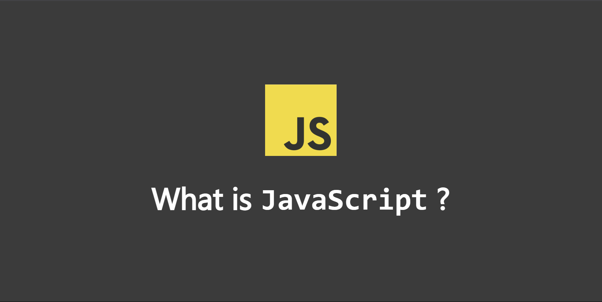

/# JavaScript Essentials Repository

  

Welcome to the JavaScript Essentials repository! This repository is designed to help you understand the fundamental concepts of JavaScript, including variable declarations, data types, and scope.

## Contents

### 1. [Variable Declaration and Scope](./declaration/README.md)
Learn about the different ways to declare variables in JavaScript (`var`, `let`, `const`) and understand the concept of scope (global, function, and block scope).

### 2. [Primitive and Non-Primitive Data Types](./data-structure/README.md)
Explore the various data types in JavaScript, including primitives (null, undefined, boolean, string, bigint, number) and non-primitives (array, object, Map, Set).

### 3. [Examples and Practice](./declaration/declaration.js)
Check out practical examples of variable declarations and scope in JavaScript.

### 4. [Looping in JavaScript](./looping/README.md)
Understand the fundamental concepts of looping in JavaScript, including `for`, `while`, `do...while`, `for...of`, and `for...in` loops. Learn how to use `break` and `continue` statements to control loop execution.

## How to Use This Repository

1. Clone the repository to your local machine.
2. Open the `index.html` file in your browser to see the examples in action.
3. Navigate through the provided links to read more about each concept.

Feel free to explore and modify the code to deepen your understanding of JavaScript. Happy coding!
